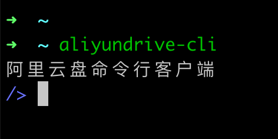
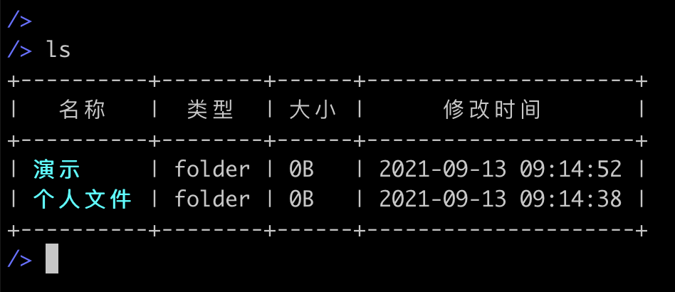
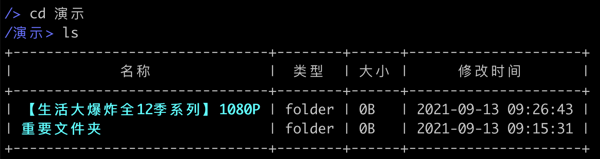
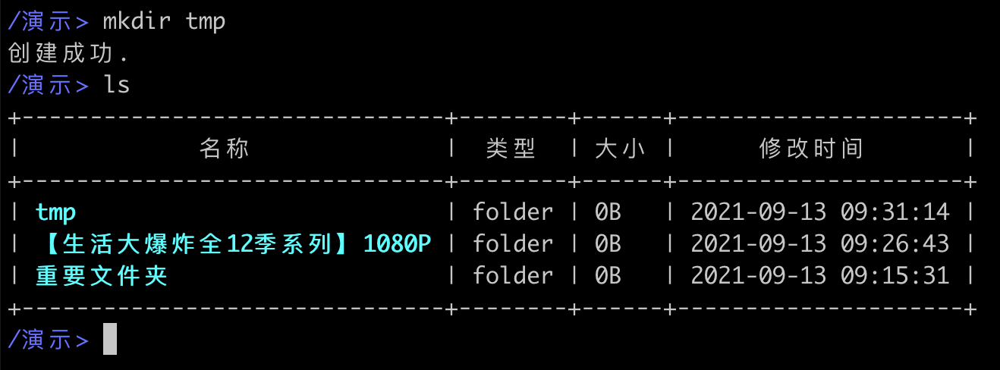
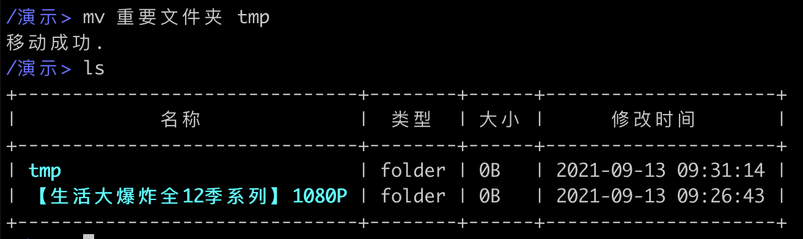
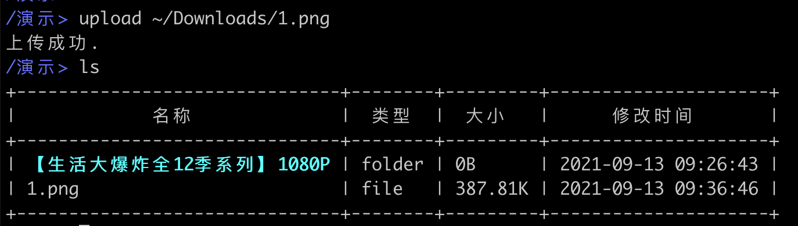
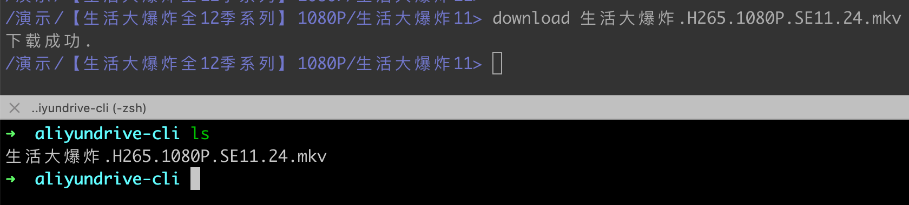

# aliyundrive-cli

阿里云盘命令行客户端

## 安装

```shell
go install github.com/chyroc/aliyundrive-cli@latest
```

## 交流

[点击进入飞书群聊](https://applink.feishu.cn/client/chat/chatter/add_by_link?link_token=994r0363-759c-47f8-a392-f1be6349c547)

## 使用

| 功能        | 截图                                |
|-----------|-----------------------------------|
| 1. 开始使用   |     |
| 2. 列出文件   |        |
| 3. 进入一个目录 |        |
| 4. 创建文件夹  |     |
| 5. 移动文件   |        |
| 6. 删除文件   |        |
| 7. 上传文件   |    |
| 8. 下载文件   |  |
| 9. 投屏视频到电视   | [view on youtube](https://www.youtube.com/watch?v=N74dQ2e9tMo) or  |

## 其他

- 基于 [SDK chyroc/go-aliyundrive](https://github.com/chyroc/go-aliyundrive) 完成
